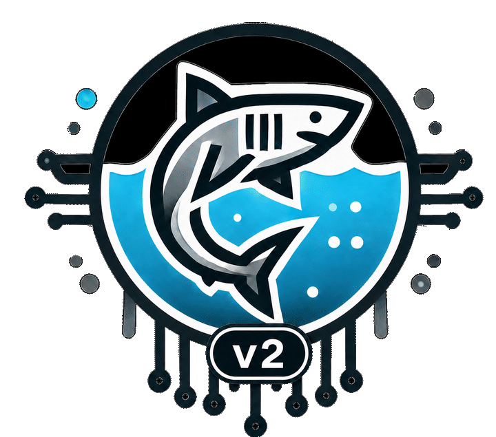

[](https://www.python.org/downloads/release/python-3120/)
[](https://mamba.readthedocs.io)
[]()
[](https://j-ehrhardt.github.io/hai-cps-benchmark/)
[](LICENSE)
[]([https://dx.doi.org/10.21227/5ewb-cn40](https://dx.doi.org/10.21227/5ewb-cn40))




# Hamburg AI Benchmark for Cyber-Physical Production Systems (HAI-CPPS) v2

The **Hamburg AI Benchmark for Cyber-Physical Production Systems (HAI-CPPS)** is a comprehensive dataset for evaluating AI models from the domains of **anomaly detection, diagnosis, reconfiguration, and planning** for Cyber-Physical Production Sytems.

HAI-CPPS is constructed as a benchmark, consisting of ten different scenarios of a modular process plant showing different functionalities and increasing complexities. This allows you to comprehensively test your algorithm not only on a single use-case but systematically on increasingly complex examples from the same domain. Each campaign run is either normal or contains one induced fault proxy in one module of the CPS.

HAI-CPPS consists of

- OpenModelica simulation models
- Pre-simulated datasets for benchmarking
- Docker integration for easy execution

In addition to the existing setups, you can create and simulate your own simulations and system constellations, using the OpenModelica models and the HAI-CPPS python API.

You can find the documentation of HAI-CPPS [here](https://j-ehrhardt.github.io/hai-cpps-benchmark/)

> [!NOTE]
> HAI-CPPS extends the **Benchmark for Diagnosis, Reconfiguration, and Planning (BeRfiPl)**. You can access the previous version [here](https://github.com/j-ehrhardt/benchmark-for-diagnosis-reconf-planning/tree/benchmark_v1).

> [!NOTE]
> We updated HAI-CPPS to HAI-CPPS v2 (also in IEEE Dataport). The update removed the "clogging" anomaly, as it was not detectable or diagnosable given the available data. We are very sorry for the inconveniences. The code for generating HAI-CPPS v1 lives now in the branch `hai-cpps-v1` in this repository. As IEEE Dataport is versioned, you should be able to access the old datasets there, too.

### Table of Contents

1. [Introduction](#hamburg-ai-benchmark-for-cyber-physical-production-systems-hai-cpps-v2)
2. [Requirements](#requirements)
3. [Installation](#installation)
4. [HAI-CPPS - Overview](#hai-cpps---overview)
   - [CPPS - Modules](#cpps---modules)
   - [Anomalies](#anomalies)
   - [Benchmark Datasets](#benchmark-datasets)
   - [Access the Benchmark Datasets](#access-the-benchmark-datasets)
5. [Using the Simulation Models](#using-the-simulation-models)
   - [Create Your Own Simulations](#create-your-own-simulation)
   - [Replicating the Benchmark](#replicate-the-benchmark-datasets)
6. [Using the Benchmark](#using-the-benchmark)
7. [Citation](#citation)

# Requirements

**For local use**:

> [!NOTE]
> Local use has only been tested on Ubuntu 22.04 LTS and Ubuntu 24.04 LTS. While the models should work without a problem in the OpenModelica Shell or OpenModelica Editor, the Python API run into problems.

- For running the benchmark you need an installation of OpenModelica `1.25` and OpenModelica Standard Library `4.0.0`.
- All other requirements can be found in the `venv.yml` file.

**Using Docker:**

- If you want to run the simulation from within the Docker container, you need a current version of Docker.

# Installation

**For local use:**

Install OpenModelica by following the install instruction from the [OpenModelica website](https://openmodelica.org/download/download-linux/).

For installing all other requirements, install a current version of Mini-Forge and type the following into your terminal:

```bash
mamba env create --file venv.yml
conda activate hai-cps
```

Validate the supplied benchmark configuration before starting a simulation:

```bash
python code/sim.py validate --config code/benchmark_setup.json
```

**Using Docker:**

Set up the Docker image via the `Dockerfile`, by navigating into the repository root and entering:

```bash
docker build --tag hai-cpps:v2 .
```

The default container command validates the bundled configuration:

```bash
docker run --rm hai-cpps:v2
```

To run a simulation, mount a host location for the generated release and Modelica build artifacts:

```bash
mkdir -p output
docker run --rm -v "$PWD/output:/work" hai-cpps:v2 run \
  --config code/benchmark_setup.json \
  --campaign normal \
  --scenario ds1 \
  --output /work/results \
  --build-root /work/build \
  --seed 20260831
```

# HAI-CPPS - Overview

The HAI-CPPS benchmark consists of ten datasets from ten different configurations of a modular Cyber-Physical Process plant. The process plant itself has four different types of modules that can be interchangeably connected. Each dataset in the benchmark is recorded from a different configuration of the Cyber-Physical Process plant.

### CPPS - Modules

The Cyber-Physical Process plant has four different types of modules: **(a) mixing, (b) filtering, (c) distilling, (d) bottling**. In addition there is a source and a sink module.

You can find the OpenModelica models for the four different modules in the `models` directory along. All modules are controlled by their own automaton.

| (a)       | (b)       |
| ------------------------------------------------ | ------------------------------------------------- |
| **(c)** | **(d)** |

### Anomalies

The supported anomaly classes depend on the module type. While some anomalies only affect the modules in which they are induced, some propagate directly and indirectly into other modules. A fault campaign enables exactly one of the following fault proxies at a time.

- **Leaking Anomaly:** The leaking valve is opened and a continuous volume flow is diverted into a separate sink and vanishes from the system.

- **Pump Lower Performance 75%:** The pump is only working on 75% of its actual performance.

- **Pump Lower Performance 50%:** The pump is only working on 50% of its actual performance.

- **Inlet Valve Anomaly:** An inlet valve cannot close completely and remains opened at 20%.

- **Filter Pollution Anomaly:** The filter pollution factor is increased after fault onset.

- **Heater Lower Performance 75% / 50%:** The distillation heater operates at the corresponding fraction of its nominal heat input.

## Benchmark Datasets

The idea of HAI-CPPS is to offer a comprehensive benchmark for Machine Learning Algorithms for technical systems. HAI-CPPS is especially suited for algorithms from the domains of **anomaly detection, reconfiguration, and diagnosis**. Therefore HAI-CPPS provides ten different datasets that each are recorded from a different, increasingly complex instance of the CPPS. The setup allows you to evaluate and compare your algorithms systematically in the dimensions of CPPS complexity and problem complexity.

Each generated scenario provides three separate measurement views:

- **Discrete mode:** Only discrete values from the process plant are recorded.
- **Continuous mode:** Only continuous values from the process plant are recorded.
- **Hybrid mode:** All recorded measurement values from the process plant are included.

Simulator-internal states are supplied separately in `oracle_states.parquet`. They are intended for offline targets and analysis, never as automatic online model inputs. Fault events, system knowledge, and technical timing are also stored separately as metadata so that they do not become accidental measurement features.

Below is an image of ten standard setups of HAI-CPPS.


## Access the Benchmark Datasets


The benchmark datasets are published via IEEE Dataport. You can access the datasets by following this [link](https://ieee-dataport.org/open-access/hai-cpps-hamburg-ai-benchmark-cyber-physical-production-systems-v2).

Alternatively, you can replicate the datasets by running the simulation setups yourself. Therefore follow the instructions in [Replicate the Benchmark Datasets](#replicate-the-benchmark-datasets).

# Using the Simulation Models

You can use the code and models from this repository in two ways. Either, you simulate your own scenarios or you recreate the benchmark.

> If you want to use the models in Simulink, you can export to FMU models from the OMEdit and import them into Simulink.

## Replicate the Benchmark Datasets

With the project environment activated and `omc` available on `PATH`, generate the complete v2 campaign with:

```bash
python code/sim.py run \
  --config code/benchmark_setup.json \
  --campaign full \
  --output output/v2 \
  --build-root work/v2 \
  --seed 42
```

`full` generates one normal run and every supported single-fault run for each of the ten datasets (10 normal and 110 single-fault runs with the supplied configuration). The command fails if an OpenModelica result is incomplete, an export is unsafe, or a fault is not detectable in the measurement data.

Each generated scenario has this layout:

```text
<scenario_id>/
  continuous/measurements.parquet
  discrete/measurements.parquet
  hybrid/measurements.parquet
  oracle_states.parquet
  fault_events.json
  system_knowledge.yaml
  technical_timing.json
  sim_setup.json
  provenance.json
  validation.json
  audit/internal_verification.csv
```

Only a `measurements.parquet` file is a deployable feature table. Oracle states include selected internal operation, actuator, disturbance, and fault-mechanism states, with their exact raw Modelica provenance documented in `system_knowledge.yaml`. The audit CSV is used by campaign validation and is not a release feature table.

For leakage-safe loading, add `code/` to `PYTHONPATH` and use `load_scenario_dataset`. Oracle loading is explicit and remains a separate DataFrame:

```python
from pathlib import Path

from dataset_io import load_scenario_dataset

online = load_scenario_dataset(
    Path("/path/to/scenario"), measurement_view="hybrid"
)
online_feature_matrix = online.online_features

offline = load_scenario_dataset(
    Path("/path/to/scenario"),
    measurement_view="hybrid",
    include_oracle=True,
)
```

To regenerate an existing output, add `--force`. This replaces only the selected scenario release and regenerates its simulation build. Use `--resume` to reuse a complete, compatible scenario release; it cannot be combined with `--force`.

On a multi-core computer, datasets can be generated concurrently with GNU Parallel. Each job must have its own output and build root:

```bash
parallel -j 4 --line-buffer --halt soon,fail=1 \
  'python code/sim.py run \
    --config code/benchmark_setup.json \
    --campaign full \
    --scenario {} \
    --output output/{} \
    --build-root work/{} \
    --seed 42' \
  ::: ds1 ds2 ds3 ds4 ds5 ds6 ds7 ds8 ds9 ds10
```

Adjust `-j 4` to the number of concurrent simulations your machine can sustain. Do not share a build root between parallel simulation processes.

> [!WARNING]
> Attention! The simulations takes time, so be prepared to let your computer run for a while.

## Create Your Own Simulation

If you want to create your own CPPS configurations and simulations, you can either use the OpenModelica Editor (OMEdit) or you use the python interface provided in this repository.

When using OMEdit, simply load the models from the `models` directory and assemble them into a new configuration.

When using the Python interface, create a configuration based on `code/benchmark_setup.json` and validate it before simulating it:

```bash
python code/sim.py validate --config /path/to/benchmark_setup.json
python code/sim.py run \
  --config /path/to/benchmark_setup.json \
  --campaign full \
  --output output/custom \
  --build-root work/custom \
  --seed 42
```

The validator checks the configuration schema, module types, port connectivity, enabled fault names, exclusive fault pairs, timing, and referenced model files.

# Using the Benchmark

Using HAI-CPPS benchmark is pretty self-explanatory. Download or create the datasets yourself. Select the discrete, continuous, or hybrid measurement view in which you want to operate. Train your models using normal runs and test them on an anomalous test scenario. Fault onset and its relation to the sampled measurement timestamps are recorded in `technical_timing.json`; the target module and fault proxy are recorded in `fault_events.json`.

As a reference, you can have a look at the following repository [Discret2Di](https://github.com/lmoddemann/Discret2Di).

# Citation

When using the HAI-CPPS benchmark, please use the following citation:

```bibtex
   @data{haicpps,
   doi = {10.21227/5ewb-cn40},
   url = {https://dx.doi.org/10.21227/5ewb-cn40},
   author = {Jonas Ehrhardt and Lukas Moddemann and Alexander Diedrich and Oliver Niggemann},
   publisher = {IEEE Dataport},
   title = {HAI-CPPS: The Hamburg AI Benchmark for Cyber-Physical Production Sytems},
   year = {2025} }
```

When using the original benchmark (BeRFiPl) please cite:

```bibtex
@INPROCEEDINGS{Ehrhardt2022,
  author={Ehrhardt, Jonas and Ramonat, Malte and Heesch, René and Balzereit, Kaja and Diedrich, Alexander and Niggemann, Oliver},
  booktitle={2022 IEEE 27th International Conference on Emerging Technologies and Factory Automation (ETFA)},
  title={An AI benchmark for Diagnosis, Reconfiguration & Planning},
  year={2022},
  pages={1-8},
  organization = {IEEE},
  doi={10.1109/ETFA52439.2022.9921546}}
```

## LICENSE

The simulation models are licensed under [MIT license](LICENSE).
