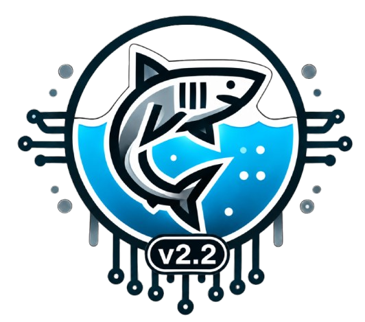
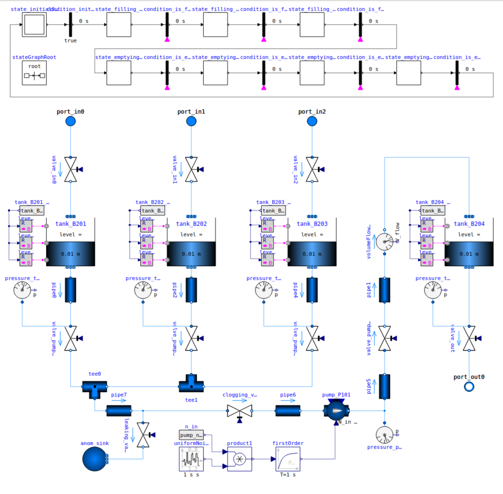
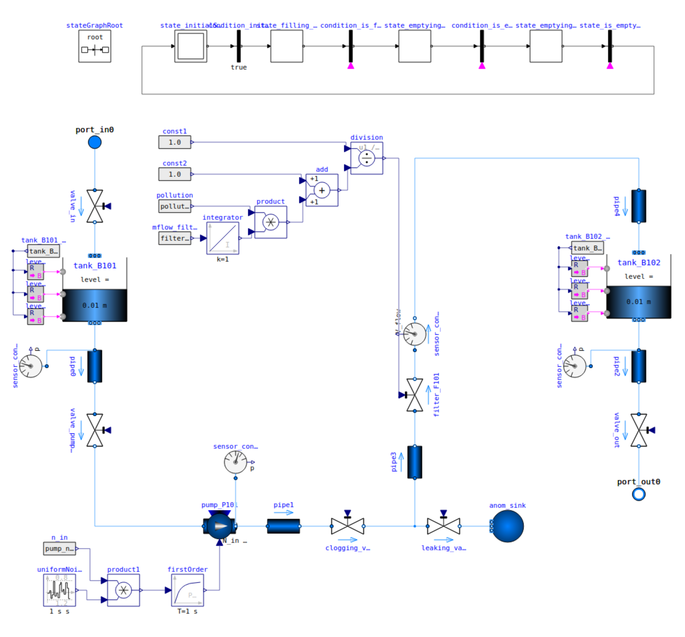
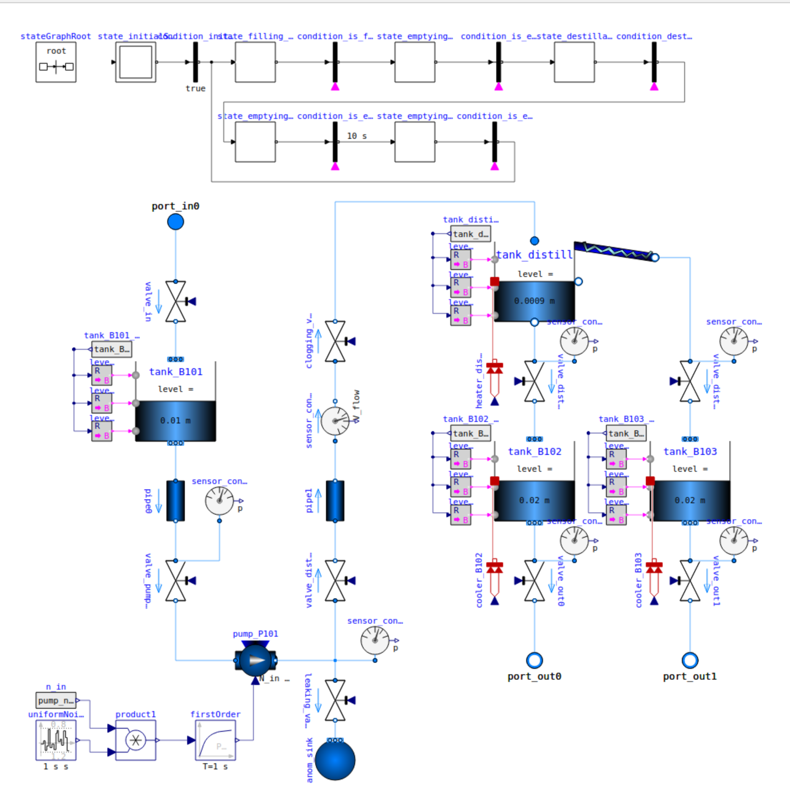
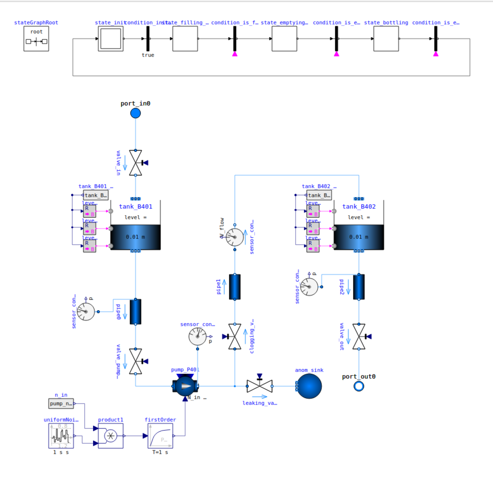

# Hamburg AI Benchmark for Cyber-Physical Production Systems (HAI-CPPS) v2.2

This repository generates the HAI-CPPS v2.2 simulation benchmark with OpenModelica. It contains ten predefined plant topologies (`ds1` through `ds10`). Each topology has healthy recordings and single-fault recordings with persistent and temporary fault windows. A complete campaign has **350 recordings**: 160 healthy and 190 faulty.

> [!NOTE]
> HAI-CPPS extends the **Benchmark for Diagnosis, Reconfiguration, and Planning (BeRfiPl)**. You can access the previous version [here](https://github.com/j-ehrhardt/benchmark-for-diagnosis-reconf-planning/tree/berfipl).

> [!NOTE]
> We updated HAI-CPPS to HAI-CPPS v2 (also in IEEE Dataport). The update removed the "clogging" anomaly, as it was not detectable or diagnosable given the available data. We are very sorry for the inconveniences. The code for generating HAI-CPPS v1 lives now in the branch `v1.0` in this repository. All other versions are versioned on separate branches. As IEEE Dataport is versioned, you should be able to access the old datasets there, too.

You can find the documentation of HAI-CPPS [here](https://j-ehrhardt.github.io/hai-cpps-benchmark/)


# Overview

The HAI-CPPS benchmark consists of ten datasets from ten different configurations of a modular Cyber-Physical Process plant. The process plant itself has four different types of modules that can be interchangeably connected. Each dataset in the benchmark is recorded from a different configuration of the Cyber-Physical Process plant.

### CPPS - Modules

The Cyber-Physical Process plant has four different types of modules: **(a) mixing, (b) filtering, (c) distilling, (d) bottling**. In addition there is a source and a sink module.

You can find the OpenModelica models for the four different modules in the `models` directory along. All modules are controlled by their own automaton.

|  (a)      |   (b)     |
| ------------------------------------------------ | ------------------------------------------------- |
|  (c)    |  (d)    |

### Anomalies

The supported anomaly classes depend on the module type. While some anomalies only affect the modules in which they are induced, some propagate directly and indirectly into other modules. A fault campaign enables exactly one of the following fault proxies at a time.

- **Leaking Anomaly:** The leaking valve is opened and a continuous volume flow is diverted into a separate sink and vanishes from the system.

- **Pump Lower Performance 75%:** The pump is only working on 75% of its actual performance.

- **Pump Lower Performance 50%:** The pump is only working on 50% of its actual performance.

- **Inlet Valve Anomaly:** An inlet valve cannot close completely and remains opened at 20%.

- **Filter Pollution Anomaly:** The filter pollution factor is increased after fault onset.

- **Heater Lower Performance 75% / 50%:** The distillation heater operates at the corresponding fraction of its nominal heat input.

## Benchmark Datasets

The idea of HAI-CPPS is to offer a comprehensive benchmark for Machine Learning Algorithms for technical systems. HAI-CPPS is especially suited for algorithms from the domains of **anomaly detection, reconfiguration, and diagnosis**. Therefore HAI-CPPS provides ten different datasets that each are recorded from a different, increasingly complex instance of the CPPS. The setup allows you to evaluate and compare your algorithms systematically in the dimensions of CPPS complexity and problem complexity.

Each generated scenario provides three separate measurement views:

- **Discrete mode:** Only discrete values from the process plant are recorded.
- **Continuous mode:** Only continuous values from the process plant are recorded.
- **Hybrid mode:** All recorded measurement values from the process plant are included.

Simulator-internal states are supplied separately in `oracle_states.parquet`. They are intended for offline targets and analysis, never as automatic online model inputs. Fault events, system knowledge, and technical timing are also stored separately as metadata so that they do not become accidental measurement features.

Below is an image of ten standard setups of HAI-CPPS.


## Access the Benchmark Datasets


The benchmark datasets are published via IEEE Dataport. You can access the datasets by following this [link](https://ieee-dataport.org/open-access/hai-cpps-hamburg-ai-benchmark-cyber-physical-production-systems-v2).


# Working with the Repository

Alternatively, you can replicate the datasets by running the simulation setups yourself.
You can even add your own modules and CPPS setup and simluate them. 
The three commands below are the supported workflows. Run them from the repository root.

## 1. Install on Ubuntu

Install system packages and OpenModelica.

```bash
sudo apt update
sudo apt install ca-certificates curl gnupg build-essential python3 python3-venv python3-pip
curl -fsSL https://build.openmodelica.org/apt/openmodelica-2026.asc \
  | sudo gpg --dearmor --yes -o /usr/share/keyrings/openmodelica-keyring.gpg
. /etc/os-release
echo "deb [arch=$(dpkg --print-architecture) signed-by=/usr/share/keyrings/openmodelica-keyring.gpg] https://build.openmodelica.org/apt ${VERSION_CODENAME} stable" \
  | sudo tee /etc/apt/sources.list.d/openmodelica.list
sudo apt update
sudo apt install --no-install-recommends omc
omc --version
```

The models require **Modelica Standard Library 4.0.0**. OpenModelica manages libraries separately from the compiler. Install the exact version with its [package manager](https://openmodelica.org/doc/OpenModelicaUsersGuide/latest/packagemanager.html):

```bash
cat > /tmp/hai-cpps-msl.mos <<'MOS'
updatePackageIndex();
installPackage(Modelica, "4.0.0", exactMatch=true);
loadModel(Modelica, {"4.0.0"}, requireExactVersion=true);
getVersion(Modelica);
getErrorString();
MOS
omc /tmp/hai-cpps-msl.mos
```

Check that the installation prints `true` for `installPackage` and `loadModel`, and `"4.0.0"` for `getVersion`. The exact-version option is documented in the [OpenModelica scripting API](https://openmodelica.org/doc/OpenModelicaUsersGuide/latest/scripting_api.html). This repository was smoke tested with OpenModelica 1.26.1 and MSL 4.0.0.

Create a Python virtual environment and install the direct dependencies:

```bash
python3 -m venv .venv
source .venv/bin/activate
python -m pip install --upgrade pip
python -m pip install -r requirements.txt
```

Activate the environment again with `source .venv/bin/activate` in each new shell.

## 2. Run all benchmark datasets

First inspect the work list without writing outputs:

```bash
python code/campaign.py --plan
```

Run all ten datasets and all configured faults with four concurrent simulations:

```bash
python code/campaign.py --jobs 4
```

Set `--jobs` to the number of simulations your computer can run at once. Each worker has an isolated OpenModelica build directory. The launcher schedules healthy controls before their paired faults, writes logs under `build/v2.2/campaign/logs/`, and validates the completed campaign. Rerun the same command after an interruption to reuse complete recordings. Choose new `--output` and `--build-root` directories if you change the configuration or source after starting a campaign.

The default result is `output/v2.2/`. For example, one recording is in `output/v2.2/ds1/ds1/ds1_001_healthy/`. Each recording contains continuous, discrete, and hybrid Parquet measurements, controller commands, fault and timing metadata, validation results, and provenance. `output/v2.2/release_manifest.json` summarizes a validated full campaign. Generated files stay outside the source directories and are ignored by Git.

You can choose output locations explicitly:

```bash
python code/campaign.py --jobs 8 --output /path/to/results --build-root /path/to/build
```

## 3. Run one benchmark dataset

Use the same launcher with `--dataset`:

```bash
python code/campaign.py --dataset ds1 --jobs 4
```

This plans and runs the complete `ds1` campaign: 16 healthy recordings and 12 fault recordings. Its summary is `output/v2.2/ds1_release_manifest.json`. Any of `ds1` through `ds10` is accepted. Run `python code/campaign.py --dataset ds1 --plan` to inspect the selected work first.

## 4. Simulate your own topology

Copy [the example configuration](examples/custom.json) and edit its `modules` and `edges`. Each edge connects one output port to one input port. Every declared port must be connected exactly once. `files` paths are relative to the JSON file. You can combine the modules in `models/` without changing them.

For a new Modelica module, add a `.mo` file and set its `type` to `custom`. Supply `modelica_class`, `input_ports`, and `output_ports` in the JSON. The class must define a replaceable `Medium` package and expose the listed ports. [PassThrough.mo](examples/PassThrough.mo) shows a small custom pipe module. Custom modules currently have an empty `faults` object; the benchmark's predefined fault campaign applies to its validated built-in modules.

Run the included example:

```bash
python code/simulate.py --config examples/custom.json --dataset custom1
```

The raw result is `output/custom/custom1/processPlant_res.csv`. The same directory contains the generated plant, OpenModelica script, and compiler logs. `simulate.py` checks that OpenModelica loaded MSL 4.0.0 and produced the full requested time grid. Use `--output /path/to/new/output` for another run; an existing run directory is kept rather than overwritten.

For an existing topology or a built-in-only combination, use the same JSON format and command. Keep a source, a sink, and a valid connection for every port. The `sim_setup` object sets `startTime`, `stopTime`, `numberOfIntervals`, `faultStart`, and `seed`.

## Repository map

- `models/`: validated Modelica modules used by the benchmark.
- `code/benchmark_setup.json`: ten benchmark topologies and fault inventories.
- `code/campaign.py`: parallel full or single-dataset v2.2 campaign.
- `code/simulate.py`: one raw simulation for a user topology.
- `code/config.py`, `code/model_generation.py`, `code/runner.py`, `code/sim.py`: configuration, plant generation, OpenModelica execution, and validated benchmark export.
- `examples/`: a working configuration with an additional Modelica module.

To run the focused Python tests, install `pytest` in the virtual environment and run `python -m pytest -q`.

# Using the Benchmark

Using HAI-CPPS benchmark is pretty self-explanatory. Download or create the datasets yourself. Select the discrete, continuous, or hybrid measurement view in which you want to operate. Train your models using normal runs and test them on an anomalous test scenario. Fault onset and its relation to the sampled measurement timestamps are recorded in `technical_timing.json`; the target module and fault proxy are recorded in `fault_events.json`.

As a reference, you can have a look at the following repository [Discret2Di](https://github.com/lmoddemann/Discret2Di).

# Citation

When using the HAI-CPPS benchmark, please use the following citations:

```bibtex
   @data{haicpps,
   doi = {10.21227/5ewb-cn40},
   url = {https://dx.doi.org/10.21227/5ewb-cn40},
   author = {Jonas Ehrhardt and Lukas Moddemann and Alexander Diedrich and Oliver Niggemann},
   publisher = {IEEE Dataport},
   title = {HAI-CPPS: The Hamburg AI Benchmark for Cyber-Physical Production Sytems},
   year = {2025} }
```

```bibtex
@INPROCEEDINGS{Moddemann2025HAICPPS,
  author={Moddemann, Lukas and Ehrhardt, Jonas and Diedrich, Alexander and Niggemann, Oliver},
  booktitle={2025 IEEE 30th International Conference on Emerging Technologies and Factory Automation (ETFA)},
  title={The HAI-CPPS Benchmark: Evaluating AI Capabilities Across Hybrid Data Spaces},
  year={2025},
  pages={1-8},
  doi={10.1109/ETFA65518.2025.11205680}}
```

When using the original benchmark (BeRFiPl) please cite:

```bibtex
@INPROCEEDINGS{Ehrhardt2022,
  author={Ehrhardt, Jonas and Ramonat, Malte and Heesch, René and Balzereit, Kaja and Diedrich, Alexander and Niggemann, Oliver},
  booktitle={2022 IEEE 27th International Conference on Emerging Technologies and Factory Automation (ETFA)},
  title={An AI benchmark for Diagnosis, Reconfiguration & Planning},
  year={2022},
  pages={1-8},
  organization = {IEEE},
  doi={10.1109/ETFA52439.2022.9921546}}
```

## License

See [LICENSE](LICENSE).
